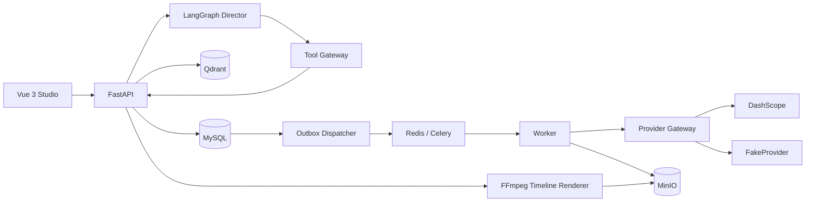

# 架构

FrameForge AI 以 MySQL 为业务事实源。Vue 前端只调用 FastAPI；Agent 通过 Tool Gateway 访问受限业务工具。生成任务在同一 MySQL 事务中写入 Job 和 Outbox，Dispatcher 投递 Celery，Worker 调用 Provider Gateway，输出经校验后存入 MinIO。

`/health/live` 检查进程；`/health/ready` 检查 MySQL、Redis、Qdrant、MinIO。外部模型故障不影响 Core API readiness。开发环境由 `docker-compose.yml` 启动，所有对宿主机开放的端口只绑定 `127.0.0.1`。

当前 Director 使用确定性意图与计划；RAG 使用显式标识的测试向量。它们的能力边界见 [agent.md](agent.md) 与 [rag.md](rag.md)。
